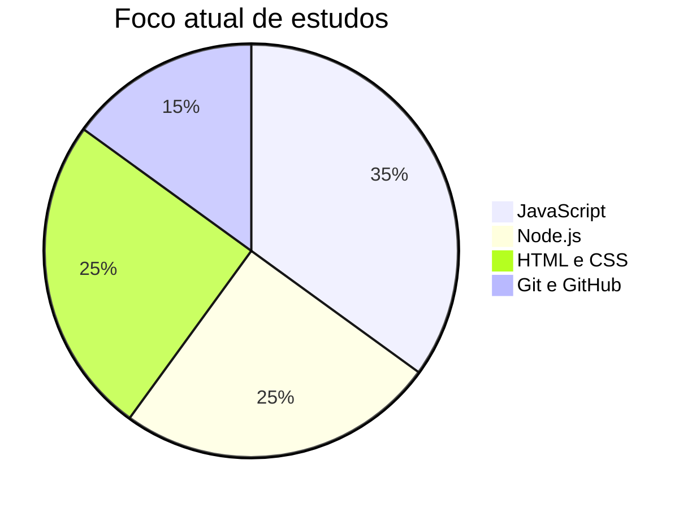

  

  
  
  

<h1 align="center">Olá, eu sou o Tomaziu</h1>

  Estudando desenvolvimento web e evoluindo um passo de cada vez.

## Sobre Mim

- Estou evoluindo em desenvolvimento web com JavaScript, Node.js, HTML e CSS.
- Gosto de aprender criando, testando e melhorando aos poucos.
- Tenho interesse por interfaces, automação e deploy de aplicações web.
- Meu foco atual é fortalecer a base em programação e boas práticas.

## Tecnologias

  
  
  
  
  
  
  

## Aprendendo Agora

| Área | Foco |
| --- | --- |
| JavaScript | Lógica, DOM e recursos modernos |
| Node.js | Servidores, rotas e APIs simples |
| HTML + CSS | Layout responsivo e interfaces limpas |
| Git + GitHub | Versionamento e publicação |

## Onde Me Encontrar

  

  

